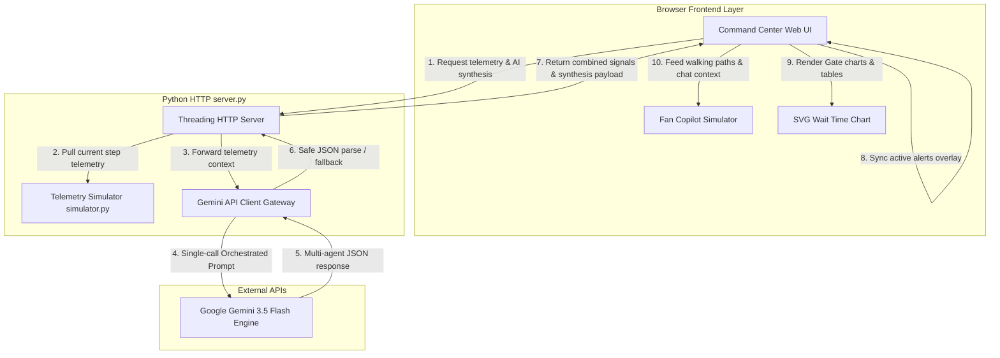
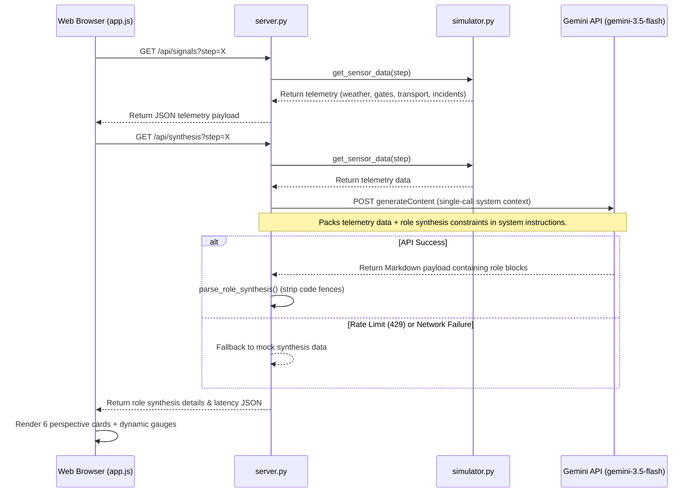

# Previa Architecture Diagram

Below is the Mermaid sequence and flow diagram detailing how Previa processes stadium telemetry, runs multi-agent synthesis using a single Gemini API call, and updates the Command Center dashboard and Fan Copilot clients.

## System Data Flow

## AI Multi-Agent Orchestration Sequence

## Key Architecture Components

1. **Multi-Threaded Server (`server.py`)**: Utilizes `ThreadingHTTPServer` to handle simultaneous browser asset loads and API requests asynchronously, avoiding socket blocking during Gemini API calls.
2. **Telemetry Simulator (`simulator.py`)**: Models the stadium queue dynamics across a timeline, exposing sensor readings for weather conditions, gate wait times, public transit status, and safety logs.
3. **Structured Parser**: The server strips markdown delimiters from Gemini outputs to produce robust JSON objects, ensuring no raw backticks or styling codes break the frontend presentation.
4. **Fallback Mechanism**: Features a resilient fallback to mock synthesis data if the Gemini API returns rate limiting errors (429 Resource Exhausted) on free tiers, ensuring uninterrupted operations.
